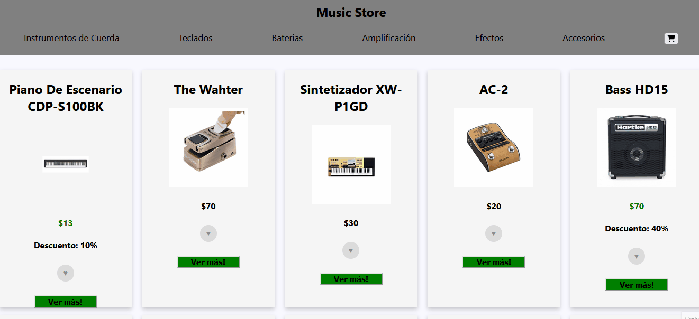

Proyecto realizado por Nahuel Bracchitta con el objetivo de aprender a utilizar ReactJs, dentro del curso realizado en CoderHouse.

El objetivo fue realizar un eCommerce donde el usuario pueda navegar a través de un catalogo, agregar y eliminar productos de un carrito de compras, luego generar su orden compra, y que ésta se almacenen una base de datos (firestore).

Esta aplicacion se focaliza en la funcionalidad y no en los estilos.

Para inicializar el repositorio usar los comandos ### `npm install` y luego ### `npm start`.

